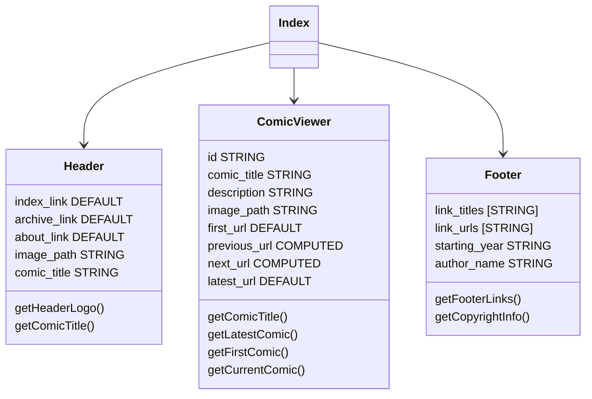
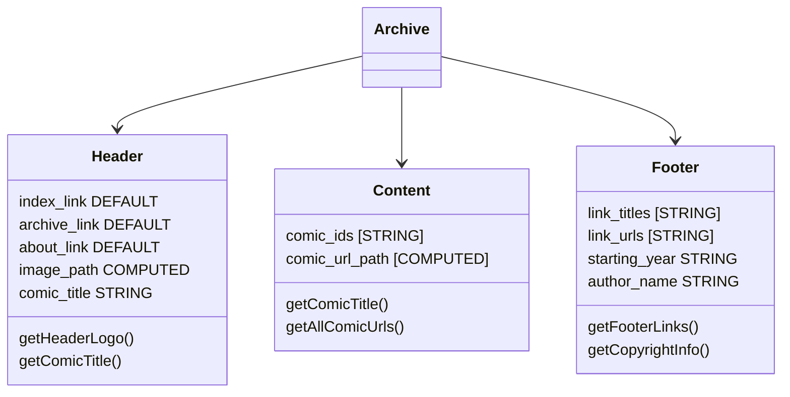
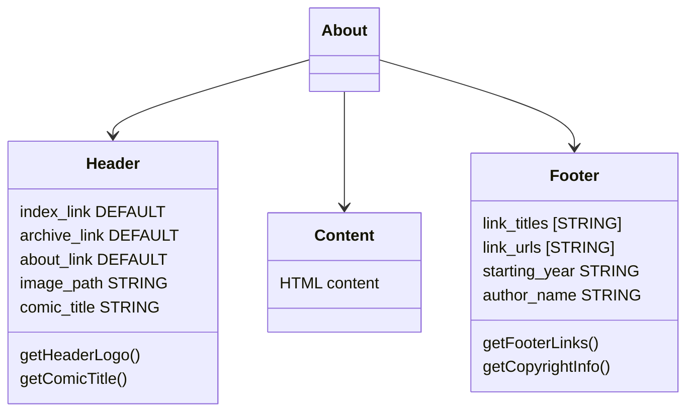

# Index

```mermaid.js
classDiagram
    class Index {
    }
    class Header {
        index_link DEFAULT
        archive_link DEFAULT
        about_link DEFAULT
        image_path STRING
        comic_title STRING
        getHeaderLogo()
        getComicTitle()
    }
    class ComicViewer {
        id STRING
        comic_title STRING
        description STRING
        image_path STRING
        first_url DEFAULT
        previous_url COMPUTED
        next_url COMPUTED
        latest_url DEFAULT
        getComicTitle()
        getLatestComic()
        getFirstComic()
        getCurrentComic()
    }
    class Footer {
        link_titles [STRING]
        link_urls [STRING]
        starting_year STRING
        author_name STRING
        getFooterLinks()
        getCopyrightInfo()
    }

    Index --> Header
    Index --> ComicViewer
    Index --> Footer


```

# Archive

```mermaid.js
classDiagram
    class Archive {
    }
    class Header {
        index_link DEFAULT
        archive_link DEFAULT
        about_link DEFAULT
        image_path COMPUTED
        comic_title STRING
        getHeaderLogo()
        getComicTitle()
    }
    class Content {
        comic_ids [STRING]
        comic_url_path [COMPUTED]
        getComicTitle()
        getAllComicUrls()
    }
    class Footer {
        link_titles [STRING]
        link_urls [STRING]
        starting_year STRING
        author_name STRING
        getFooterLinks()
        getCopyrightInfo()
    }

    Archive --> Header
    Archive --> Content
    Archive --> Footer


```

# About

```mermaid.js
classDiagram
    class About {
    }
    class Header {
        index_link DEFAULT
        archive_link DEFAULT
        about_link DEFAULT
        image_path STRING
        comic_title STRING
        getHeaderLogo()
        getComicTitle()
    }
    class Content {
        HTML content
    }
    class Footer {
        link_titles [STRING]
        link_urls [STRING]
        starting_year STRING
        author_name STRING
        getFooterLinks()
        getCopyrightInfo()
    }

    About --> Header
    About --> Content
    About --> Footer


```
